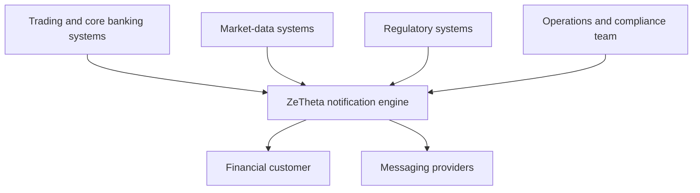
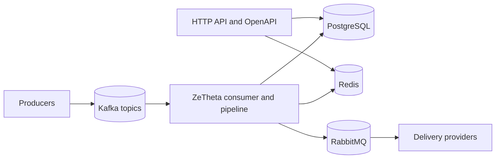
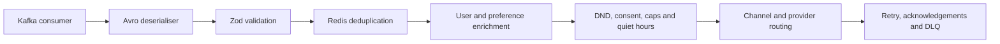
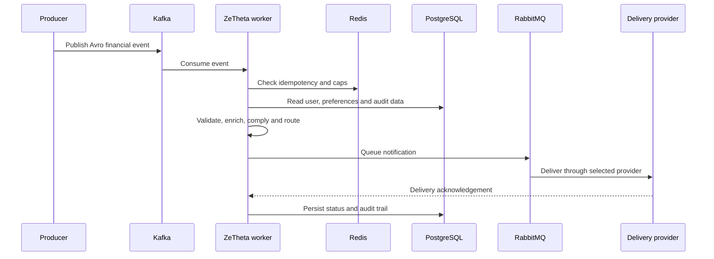
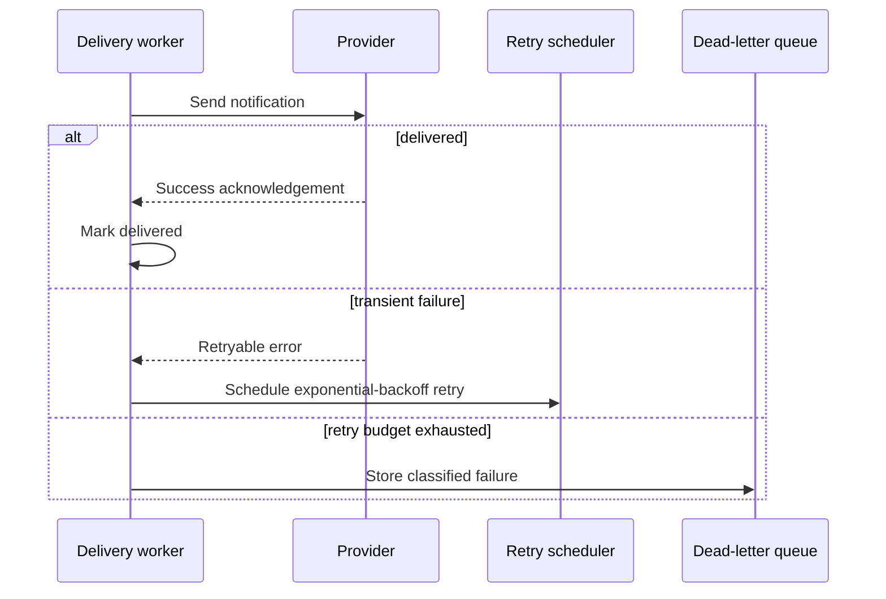
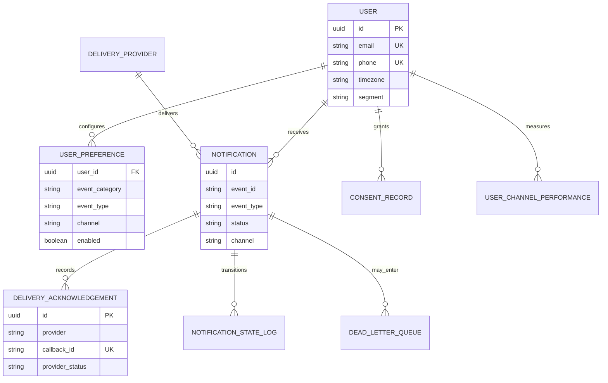

# ZeTheta architecture

## C4 system context

## C4 containers

## C4 components

## Event-processing sequence

## Failure and retry sequence

## Database ER diagram

Detailed design decisions remain in [docs/architecture.md](docs/architecture.md).
