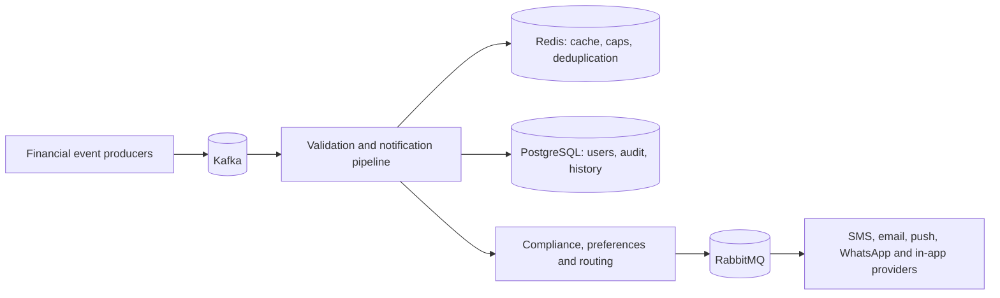

# ZeTheta - Event-Driven Financial Notification Engine

ZeTheta processes financial events and delivers compliant, personalised notifications through SMS, email, push, WhatsApp, and in-app channels. It supports 25+ financial event types, TRAI DND rules, consent and quiet-hours controls, frequency capping, provider failover, delivery tracking, retry and DLQ processing, and real-time analytics.

## Architecture at a glance



Read the detailed C4, sequence, and database diagrams in [ARCHITECTURE.md](ARCHITECTURE.md).

## Technology stack

| Concern | Technology |
| --- | --- |
| Runtime | Node.js 22 and TypeScript |
| Event ingestion | Kafka and Avro |
| Delivery queue | RabbitMQ |
| Persistence | PostgreSQL 15 with Prisma |
| Fast state | Redis 7 |
| API contract | OpenAPI 3.0 and Swagger UI |
| Testing | Vitest and k6 |
| Local deployment | Docker Compose |

## Local setup

Prerequisites: Node.js 22, npm, and Docker Desktop.

```powershell
Copy-Item .env.example .env
npm install
docker compose up -d
npx prisma migrate deploy
npx prisma generate
```

Set real provider credentials only in `.env`; do not commit that file. For a clean local database, the optional development seed command is `npx prisma db seed`.

Verify service status:

```powershell
docker compose ps
```

## API documentation

The HTTP API serves its versioned OpenAPI document at `/openapi.json` and Swagger UI at `/api-docs` when hosted by the application. The request collection is [docs/api/zetheta.postman_collection.json](docs/api/zetheta.postman_collection.json); endpoint notes are in [docs/api/README.md](docs/api/README.md).

Public routes use rate limiting, request-target sanitisation, security headers, Zod validation at mutable endpoints, and Prisma typed database queries.

## Development and tests

```powershell
npm run lint
npm test
npm run test:coverage
npm run build
```

Run the full isolated Docker integration suite, including PostgreSQL, Redis, and Kafka:

```powershell
docker compose -f docker-compose.test.yml up --build --abort-on-container-exit --exit-code-from test
docker compose -f docker-compose.test.yml down -v
```

k6 scenarios live in [load-tests](load-tests/README.md).

## Deployment

The production worker image uses a multi-stage Docker build, runs as the unprivileged `node` user, and was verified at 188 MB. Follow [DEPLOYMENT.md](DEPLOYMENT.md) for environment, migration, rollout, and rollback steps.

## CI and security

GitHub Actions runs linting, tests, build, coverage, `npm audit`, and Gitleaks on pushes and pull requests. The current dependency-audit findings are intentionally left visible until their upstream packages can be upgraded safely; do not use `npm audit fix --force` because it proposes a breaking Prisma downgrade.

See [docs/security-hardening.md](docs/security-hardening.md) for the security model and [CHANGELOG.md](CHANGELOG.md) for daily progress.
