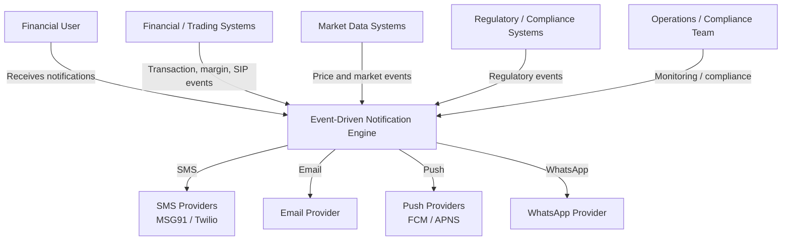
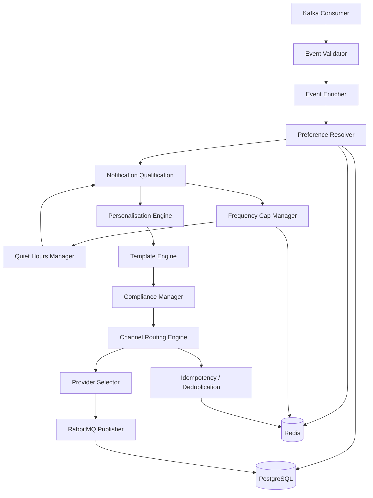

# Notification Engine Architecture

## 1. Overview

The Event-Driven Notification Engine is a scalable backend designed to process
high-volume financial events and deliver notifications across multiple channels.

The system follows an event-driven architecture where financial event producers
are decoupled from notification processing and delivery.

The architecture is designed around the following principles:

- Asynchronous event processing
- Horizontal scalability
- Critical notification isolation
- Multi-channel delivery
- Provider rate limiting
- Fault tolerance
- Retry and Dead Letter Queue handling
- TRAI DND compliance
- User preference enforcement
- Frequency capping
- Observability and auditability

---

# 2. C4 System Context Diagram

The System Context diagram shows the notification engine and its relationship
with external users, financial systems, notification providers, and operators.



## System Context Description

### Financial / Trading Systems

Generate financial events such as:

- Transaction executions
- Transaction failures
- Margin calls
- SIP reminders
- Position changes
- Account restrictions

### Market Data Systems

Generate market-related events such as:

- Price alerts
- Market movements
- Watchlist events
- Corporate actions

### Regulatory / Compliance Systems

Generate regulatory and compliance-related events.

### Financial User

Receives notifications through:

- SMS
- Email
- Push notification
- WhatsApp
- In-app notification

### Notification Providers

External providers are responsible for the final delivery of notifications.

The system must handle:

- Provider rate limits
- Provider failures
- Retries
- Circuit breakers
- Provider failover

### Operations / Compliance Team

Monitors:

- Delivery failures
- DLQ depth
- Provider health
- Compliance violations
- System health
- Critical alerts

---

## 3. C4 Container Diagram

The Container diagram shows the major deployable/runtime components of the notification platform.


## 6. Component Responsibilities

### Kafka Consumer

Consumes financial events from Kafka using consumer groups.

**Responsibilities:**

- Consume events
- Deserialize events
- Manage offsets
- Pass events to validation

### Event Validator

Validates incoming event payloads against the event schema.

Invalid events are rejected and handled according to the error strategy.

### Event Enricher

Adds contextual information required for notification processing.

**Examples:**

- User information
- User preferences
- Event metadata
- Notification priority
- Applicable channels

### Preference Resolver

Resolves the notification preference hierarchy:

```text
System Defaults
      ↓
Segment Preferences
      ↓
User Preferences
      ↓
Regulatory Override
```
Cached preferences are retrieved from Redis where possible.

### Notification Qualification

Determines whether the event should result in a notification.

**It considers:**

- Event type
- User eligibility
- Preferences
- Notification priority
- Regulatory requirements

### Frequency Cap Manager

Enforces multi-dimensional frequency limits.

**Examples:**

- Global daily cap
- Per-channel daily cap
- Per-category hourly cap
- Same-type cooldown

Redis atomic operations are used for fast counter updates.

### Quiet Hours Manager

Determines whether a notification falls within a user's quiet hours.

User timezone information is used when evaluating quiet hours.

Low-priority notifications may be delayed and aggregated into a digest.

### Personalisation Engine

Resolves user-specific data used to personalise notifications.

**Inputs can include:**

- User profile
- User preferences
- Product usage
- Behavioural features
- Language
- Channel preferences

### Template Engine

Renders notification templates using Handlebars.

**Templates support:**

- Personalisation
- Localisation
- Versioning
- Channel-specific content
- Formatting helpers

### Compliance Manager

Handles compliance-related checks.

For SMS notifications, the final DND check must happen immediately before dispatch.

The compliance layer also manages:

- Transactional/promotional classification
- Consent
- Audit information

### Channel Routing Engine

Determines the best delivery channel based on:

- Event priority
- User preferences
- Channel availability
- Channel scoring
- Compliance
- Provider health

It can also support multi-channel fan-out for events requiring simultaneous delivery.

### Provider Selector

Selects the appropriate provider for the selected channel.

**Example:**

```text
SMS
 |
 +-- MSG91
 |
 +-- Twilio
```
If the primary provider is unhealthy, the circuit breaker and failover
strategy can select an alternative provider.

### Idempotency / Deduplication

Prevents duplicate notifications during:

- Event retries
- Provider failover
- Consumer retries
- Network failures

Redis is used for TTL-based idempotency keys.

### RabbitMQ Publisher

Publishes processed notifications to RabbitMQ delivery queues.

The message contains the information required by delivery workers.

## 7. End-to-End Event Processing Pipeline

```text
Financial Event
      |
      v
Kafka
      |
      v
Kafka Consumer
      |
      v
Event Validation
      |
      v
Event Enrichment
      |
      v
Preference Resolution
      |
      v
Qualification
      |
      +-------- Not Eligible --------> Stop
      |
      v
Frequency Cap
      |
      v
Quiet Hours
      |
      v
Personalisation
      |
      v
Template Rendering
      |
      v
Compliance
      |
      v
Channel Routing
      |
      v
Provider Selection
      |
      v
Deduplication / Idempotency
      |
      v
RabbitMQ
      |
      +------------------+
      |                  |
      v                  v
Critical Worker     Normal Worker
      |                  |
      +--------+---------+
               |
               v
          Provider API
               |
          +----+----+
          |         |
       Success    Failure
          |         |
          v         v
       Delivered   Retry
                      |
                      v
                     DLQ
```
## 8. Critical vs Normal Processing

The system separates critical and normal traffic.

```text
                    Kafka
                      |
             +--------+--------+
             |                 |
             v                 v
       Critical Topic     Normal Topic
             |                 |
             v                 v
      Critical Group     Normal Group
             |                 |
             v                 v
      Critical Workers   Normal Workers
```
This prevents priority inversion during traffic spikes.
For example, a market crash may generate hundreds of thousands of price alerts while thousands of margin calls must still be delivered quickly.

## 9. Delivery and Failover

A notification is routed to the preferred channel and provider.

If the provider fails:

```text
Primary Provider
      |
      v
Circuit Breaker
      |
      +---- Healthy ----> Send
      |
      +---- Unhealthy
              |
              v
        Secondary Provider
```
Example
```text
MSG91
  |
  X
  |
  v
Twilio
```
If an entire channel becomes unavailable, the routing engine can select a fallback channel where allowed by user preferences, notification priority, and compliance rules.

## 10. Reliability Principles

The architecture follows these reliability principles.

### Asynchronous Processing

Events and delivery are processed asynchronously to avoid blocking.

### Horizontal Scalability

Kafka consumer groups and independent delivery workers can be scaled horizontally.

### Critical Traffic Isolation

Critical notifications have dedicated processing resources.

### Idempotency

Redis-based idempotency keys prevent duplicate processing and delivery.

### Retry with Backoff

Failed operations use exponential backoff with jitter.

### Dead Letter Queue

Messages that cannot be processed after the retry limit are moved to the DLQ.

### Circuit Breakers

Repeated provider failures trigger circuit breakers to prevent cascading failures.

### Backpressure

During overload, lower-priority traffic can be delayed or shed while critical traffic remains protected.

## 11. Data Flow Summary

```text
                EVENT INGESTION
                     |
                     v
                   Kafka
                     |
                     v
              PROCESSING
                     |
                     v
              QUALIFICATION
                     |
                     v
                ROUTING
                     |
                     v
                RabbitMQ
                     |
                     v
                DELIVERY
                     |
                     v
              PROVIDERS
                     |
                     v
              USER CHANNELS
```

Supporting Systems

```text
PostgreSQL
    |
    +-- Persistent state
    +-- Audit
    +-- Notification history
Redis
    |
    +-- Fast state
    +-- Caching
    +-- Rate limiting
    +-- Deduplication
``` 
## 12. Architecture Goals

- The architecture is designed to achieve:
- High-throughput event processing
- Low-latency critical notification delivery
- Horizontal scalability
- Fault tolerance
- Provider failover
- Regulatory compliance
- Reliable notification delivery
- Duplicate prevention
- Auditability
- Real-time observability